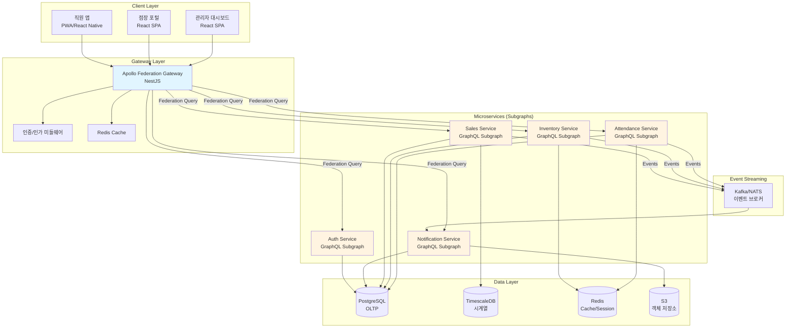
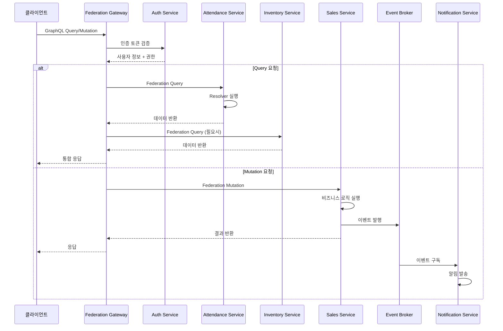

# Architecture Overview

## GraphQL Federation 아키텍처



## 시스템 토폴로지

- **클라이언트**: React SPA(관리자/점장), React Native 혹은 PWA(직원), Apollo Client + Redux Toolkit Query로 GraphQL 연동
- **Gateway**: Apollo Federation Gateway (NestJS)에서 인증/인가, 캐싱, 로깅을 담당
- **마이크로서비스**:
  - `attendance-service`: 근태 스케줄링, GPS 검증, 초과근무 워크플로
  - `inventory-service`: 실사/발주, 재고 임계치 계산, 외부 POS 연동
  - `sales-service`: 매출 집계, 시계열 저장, KPI 가공
  - `notification-service`: 이벤트 라우터, 템플릿 관리, 다중 채널 발송
  - `auth-service`: OIDC 연동, RBAC/ABAC, 토큰 발급
- **데이터 스토어**:
  - PostgreSQL(트랜잭션)
  - TimescaleDB 또는 ClickHouse(매출 시계열)
  - Redis(Cache, 세션)
  - S3 호환 객체 저장소(보고서, 이미지)
- **인프라**: Kubernetes, Istio(또는 Linkerd) 서비스 메시, Argo CD, Prometheus/Grafana, Elastic Stack

## 데이터 플로



### 상세 플로우

1. 클라이언트가 GraphQL Gateway에 Query/Mutation/Subscription 호출
2. Gateway는 인증/인가 미들웨어를 통해 JWT 토큰 검증
3. Gateway는 Federation을 통해 각 Subgraph Resolver로 요청 라우팅
4. 서비스는 ORM(TypeORM/Prisma) 또는 CQRS 패턴을 사용해 데이터베이스에 접근
5. 이벤트 기반 통신은 Kafka(또는 NATS)를 사용, Notification/Analytics가 구독
6. 매출 시계열은 ETL 파이프라인으로 OLAP 스토리지에 적재

## 통신 패턴

### 동기 통신 (Sync)

- **GraphQL over HTTP/WS**: 클라이언트 ↔ Gateway ↔ Subgraph 간 통신
  - HTTP: Query/Mutation 요청
  - WebSocket: Subscription 실시간 업데이트
- **gRPC**: 서비스 간 내부 호출 (고성능 필요 시)
- **Federation 키 전략**: `@key` 디렉티브로 엔티티 간 관계 정의

  ```graphql
  type Employee @key(fields: "id") {
    id: ID!
    attendanceRecords: [AttendanceRecord]
  }
  
  type AttendanceRecord @key(fields: "id") {
    id: ID!
    employee: Employee @requires(fields: "employeeId")
  }
  ```

### 비동기 통신 (Async)

- **Kafka Topics**:
  - `attendance.events`: 근태 승인, 출퇴근 기록 이벤트
  - `inventory.restock`: 재고 리오더, 입고 완료 이벤트
  - `sales.stream`: 매출 데이터 스트리밍
  - `alerts.triggered`: 이상 징후 감지 알림
- **이벤트 소싱**: 중요 도메인 이벤트는 이벤트 스토어에 저장
- **API 버전 관리**: Federation Schema 계약 테스트와 GitOps 브랜치를 사용

## 보안 고려사항

- 모든 내부 트래픽은 mTLS, 인증은 JWT + RBAC
- GraphQL Depth Limit, Query Cost 제한
- 민감 데이터는 KMS로 암호화, Vault에서 비밀 관리

## 운영

- OpenTelemetry Collector로 트레이싱 수집 → Jaeger/Tempo
- 로그는 Fluent Bit → ElasticSearch, Kibana 대시보드
- Canary 배포 전략: Argo Rollouts, SLA/SLO 기반 자동 롤백

## 참조

- 상위 요구사항: `../../SPEC.md`
- 관련 워크플로: `../ops/deployment.md`, `../../workflows/README.md`
